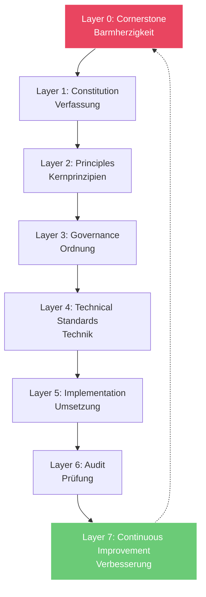

# IIOS Reference Architecture v1.0
## 8-Layer Architekturmodell

---

## Überblick

Die IIOS Reference Architecture definiert ein hierarchisches 8-Layer-Modell, das von der philosophischen Fundierung (Layer 0) bis zur kontinuierlichen Verbesserung (Layer 7) reicht.

---

## Architekturdiagramm



---

## Layer 0: Cornerstone (Eckstein)

### Definition
Der normative Anker des gesamten Systems - das unverrückbare Fundamentprinzip.

### Beispiele
- **Barmherzigkeit** (ethische Systeme)
- **Zuverlässigkeit** (technische Systeme)
- **Sicherheit** (kritische Infrastruktur)

### Output
- **Cornerstone Score** (0-100)
- Philosophische Stellungnahme
- Ableitungsnachweis

### Messung
```
Cornerstone Score = 
  Menschenwürdeschutz(30%) + 
  Verhältnismäßigkeit(25%) + 
  Transparenz(25%) + 
  Wohlwollen(20%)
```

---

## Layer 1: Constitution (Verfassung)

### Definition
Die formale Verfassung, die den Eckstein und seine Ableitungen in Artikeln festhält.

### Komponenten
- **Präambel**: Leitmotiv und Selbstverpflichtung
- **Artikel I-VII**: Eckstein, Wahrheit, Recht, Sicherheit, Nachhaltigkeit, Entwicklung, Architektur
- **Schlussbestimmung**: Unverrückbarkeit und Dynamik

### Output
- Verfassungskonformität (Ja/Nein)
- Konstitutionelle Dokumentation
- Amendments (Versionierung)

### Bezug zu Layer 0
Jeder Artikel muss nachweislich vom Eckstein abgeleitet sein.

---

## Layer 2: Principles (Prinzipien)

### Definition
Die ~10 Kernprinzipien, die aus der Constitution abgeleitet werden.

### Struktur
```
Eckstein (Layer 0)
  ↓ Ableitung
Constitution (Layer 1)
  ↓ Konkretisierung
Prinzipien (Layer 2)
  - Grundsatz 1: Wohlwollen
  - Grundsatz 2: Verhältnismäßigkeit
  - Grundsatz 3: Schutz der Menschenwürde
  - Grundsatz 4: Datenintegrität
  - Grundsatz 5: Evidenzbasierung
  ...
```

### Output
- Prinzipien-Einhaltung (%)
- Ableitungsmatrix
- Konfliktlösungsprotokolle

---

## Layer 3: Governance (Ordnung)

### Definition
Die organisatorische Struktur, die die Prinzipien in Prozesse übersetzt.

### Komponenten
- **Rollenmodell**: 6 definierte Rollen
- **Prozesse**: Entscheidungs-, Audit-, Zertifizierungsprozesse
- **Standards**: Governance Standard Dokument
- **Reporting**: Regelmäßige Berichtsstrukturen

### Rollen
| Rolle | Verantwortung |
|-------|---------------|
| Cornerstone Steward | Philosophische Leitung |
| Governance Officer | Operative Governance |
| Technical Architect | Technische Umsetzung |
| Compliance Auditor | Unabhängige Prüfung |
| Certification Reviewer | Zertifizierungsentscheidung |
| Stakeholder | Nutzung & Feedback |

### Output
- **Governance Score** (0-100)
- Organigramm
- Prozessdokumentation

---

## Layer 4: Technical Standards (Technik)

### Definition
Die technische Spezifikation, die Governance in Architektur übersetzt.

### Komponenten
- **Architecture**: Systemarchitektur und Layer-Struktur
- **Security**: Verschlüsselung, Zugriffskontrolle, Resilienz
- **Data**: Datenintegrität, Lineage, Validierung
- **Integration**: Schnittstellen und APIs

### Dokumente
- Technical Specification
- Visual Design Standard
- Security Architecture
- API Documentation

### Output
- **Integrity Score** (0-100)
- **Risk Score** (0-100)
- Architekturdokumentation
- Code-Qualitätsmetriken

---

## Layer 5: Implementation (Umsetzung)

### Definition
Die konkrete Implementierung der Technical Standards.

### Komponenten
- **Code**: Software-Implementierung
- **Infrastructure**: Hardware und Netzwerk
- **Deployment**: Ausrollprozesse
- **Operations**: Laufender Betrieb

### Pflichtfelder
Jede Implementierungsentscheidung muss ein Pflichtfeld zur Eckstein-Validierung enthalten:

```markdown
### Pflichtfeld: Eckstein-Validierung

**Komponente:** [Name]
**Begründung:** [Wie dient diese Komponente dem Eckstein?]
**Cornerstone Score Impact:** [+/- X Punkte]
```

### Output
- Funktionale Konformität
- Implementierungsdokumentation
- Testergebnisse

---

## Layer 6: Audit (Prüfung)

### Definition
Die unabhängige Überprüfung aller Layer auf Konformität.

### Audit-Typen
1. **Technisches Audit**: Code, Architektur, Security
2. **Governance-Audit**: Prozesse, Rollen, Entscheidungen
3. **Ethisches Audit**: Eckstein-Validierung, Impact
4. **Compliance-Audit**: Gesetze, Richtlinien, Standards

### Prozess
```
Antrag → Planung → Durchführung → Bericht → Empfehlungen → Nachverfolgung
```

### Output
- **Compliance Score** (0-100)
- Audit-Berichte
- Score-Berechnung
- Verbesserungsempfehlungen

---

## Layer 7: Continuous Improvement (Verbesserung)

### Definition
Der Rückkopplungsmechanismus zur kontinuierlichen Optimierung.

### Komponenten
- **Feedback Loops**: Stakeholder-Feedback, System-Metriken
- **Innovation**: Neue Technologien, Methoden
- **Re-Zertifizierung**: Regelmäßige Neubewertung
- **Adaptierung**: Dynamische Anpassung

### Rückkopplung zu Layer 0
```
Layer 7 (Verbesserung)
  ↓ Feedback
Layer 0 (Eckstein) - bleibt UNVERÄNDERT
  ↓ Neue Ableitungen
Layer 1-6 (Iterative Optimierung)
```

### Output
- **Development Score** (0-100)
- Improvement-Roadmap
- Innovations-Backlog
- Versionierung

---

## Score-Zuordnung zu Layern

| Layer | Primärer Score | Sekundärer Score |
|-------|----------------|------------------|
| 0 | Cornerstone Score | - |
| 1 | - | Cornerstone Score |
| 2 | - | Cornerstone Score |
| 3 | Governance Score | Compliance Score |
| 4 | Integrity Score | Risk Score |
| 5 | - | Integrity Score |
| 6 | Compliance Score | Alle Scores |
| 7 | Development Score | Alle Scores |

---

## IGOS Gesamtberechnung

```
IGOS Gesamtscore = 
  (Layer 0: Cornerstone Score × 0.20) +
  (Layer 1-2: Constitution/Principles → Cornerstone Alignment × 0.00) +
  (Layer 3: Governance Score × 0.15) +
  (Layer 4: Integrity Score × 0.20) +
  (Layer 4: Risk Score × 0.15) +
  (Layer 6: Compliance Score × 0.20) +
  (Layer 7: Development Score × 0.10)
```

---

## Zertifizierungs-Level nach Architektur-Reife

| Level | Layer-Abdeckung | Reifegrad |
|-------|-----------------|-----------|
| Bronze | Layer 0-4 definiert | Basis |
| Silver | Layer 0-5 implementiert | Fortgeschritten |
| Gold | Layer 0-6 auditiert | Exzellent |
| Platinum | Layer 0-7 optimiert | Best-in-Class |

---

**Version:** 1.0.0  
**Stand:** 17. Juni 2026  
**Referenz:** iios_constitution.md, certification_levels.md
