# Cornerstone Methodology: Enhanced Workflows v2.0
## Mit Mermaid-Diagrammen und verbesserten Prozessen

---

## Überblick

Dieses Dokument enthält die detaillierten Workflows für die Anwendung der Cornerstone Methodology, erweitert um visuelle Mermaid-Diagramme für bessere Nachvollziehbarkeit.

---

## Workflow 1: Radical Condensation (1000 → 100 → 10 → 1)

### Gesamtprozess-Übersicht

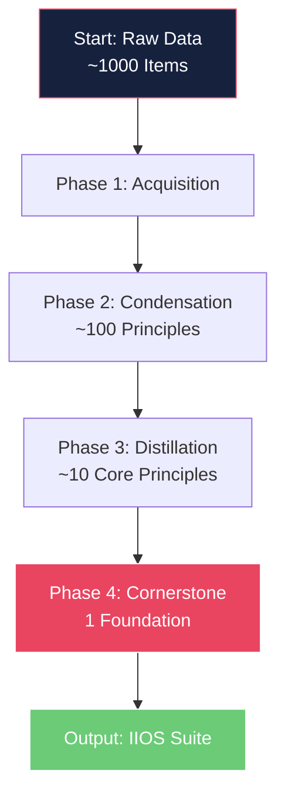

### Phase 1: Data Acquisition & Initial Categorization

**Ziel:** Sammeln aller verfügbaren Informationen und Kategorisierung in Rohregeln.

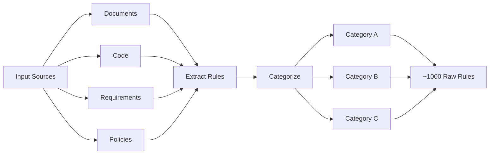

**Schritte:**

1. **Collect all relevant documents:**
   - Technical specifications
   - Codebases
   - Policy documents
   - User stories
   - Technical designs

2. **Extract raw rules/statements:**
   - Granulare Detailstufe
   - Einzelne Anforderungen identifizieren
   - Constraints dokumentieren

3. **Initial Categorization:**
   - Breite, high-level Kategorien
   - Noch nicht final (nur vorläufige Gruppierung)

**Output:** Eine umfassende Liste von ~1000 Rohregeln, gruppiert in initiale Kategorien.

---

### Phase 2: Condensation to Functional Principles

**Ziel:** Rohregeln in funktionale, handlungsorientierte Prinzipien verdichten.

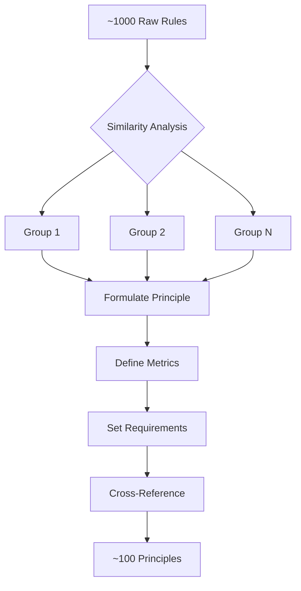

**Schritte:**

1. **Review Initial Categories:**
   - Kategorien verfeinern und zusammenführen
   - Übergeordnete Themen identifizieren

2. **Formulate Principles:**
   - Pro Kategorie 1-3 prägnante Prinzipien
   - Actionable und messbar

3. **Define Metrics/Requirements:**
   - Spezifische Metriken pro Prinzip
   - Operationale Richtlinien

4. **Cross-Reference:**
   - Alle ~1000 Regeln zu mindestens einem Prinzip zuordnen

**Output:** Eine Liste von ~100 funktionalen Prinzipien mit Metriken und Anforderungen.

---

### Phase 3: Distillation to Core Principles

**Ziel:** Funktionale Prinzipien auf ~10 Kernprinzipien destillieren.

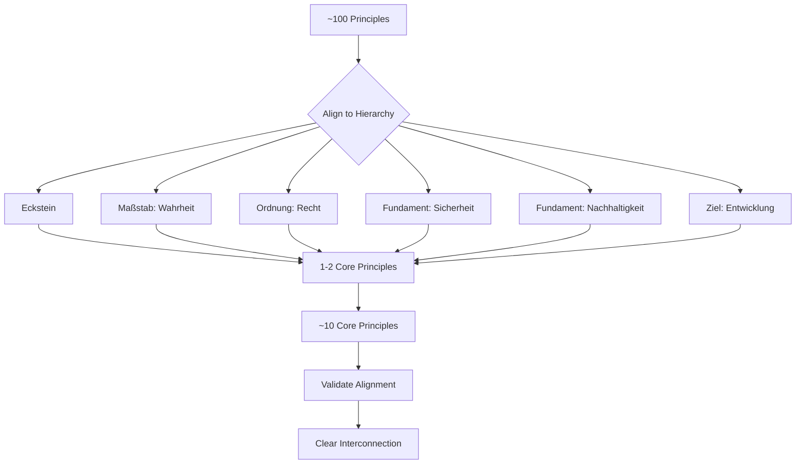

**Cornerstone Hierarchy:**
```
Eckstein:      [Wählbar: Barmherzigkeit/Zuverlässigkeit/etc.]
       ↓
Maßstab:       Wahrheit
       ↓
Ordnung:       Recht
       ↓
Fundament:     Sicherheit & Nachhaltigkeit
       ↓
Ziel:          Entwicklung
```

**Schritte:**

1. **Map to Cornerstone Hierarchy:**
   - Prinzipien an Hierarchy-Ebenen ausrichten
   - Abhängigkeiten identifizieren

2. **Synthesize Core Principles:**
   - Pro Hierarchy-Ebene 1-2 übergeordnete Prinzipien
   - Ungefähr 10 Kernprinzipien total

3. **Validate Alignment:**
   - Direkte Unterstützung des Ecksteins
   - Klare Distinktion aber Interkonnektivität

**Output:** Ein Set von ~10 Kernprinzipien, klar der Hierarchy zugeordnet.

---

### Phase 4: Identification of the Cornerstone

**Ziel:** Das eine, unverrückbare Fundament identifizieren.

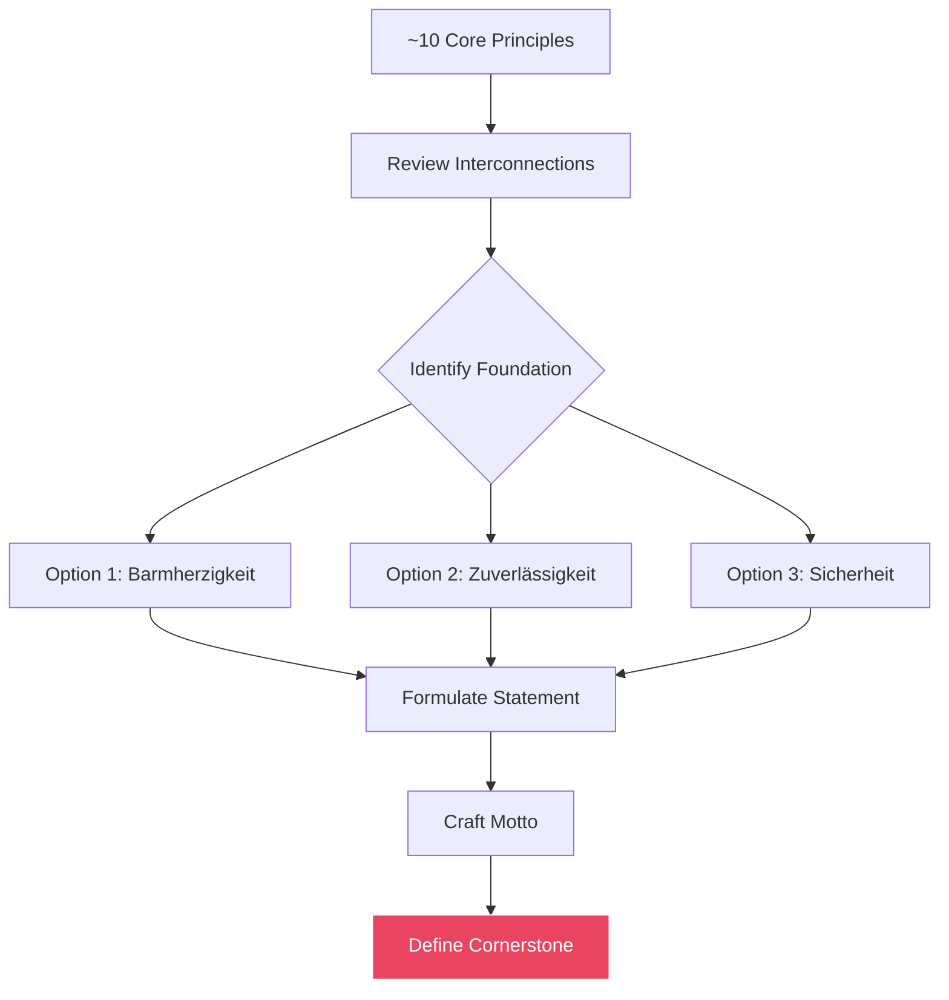

**Schritte:**

1. **Review Core Principles:**
   - Ultimativer, nicht-verhandelbarer Wert identifizieren
   - Gemeinsamer Nenner aller Prinzipien

2. **Formulate Cornerstone Statement:**
   - Prägnante Formulierung
   - Beispiele: "Menschenwürde / Barmherzigkeit", "Zuverlässigkeit"

3. **Develop Motto:**
   - Einprägsamer Satz
   - Beziehung zu anderen Prinzipien
   - Beispiel: "Barmherzigkeit ist der Eckstein; Wahrheit ihr Maßstab, Recht ihre Ordnung und Entwicklung ihre Frucht."

**Output:** Definierter Eckstein und begleitendes Motto.

---

## Workflow 2: Normative Derivation & Documentation

### Gesamtprozess

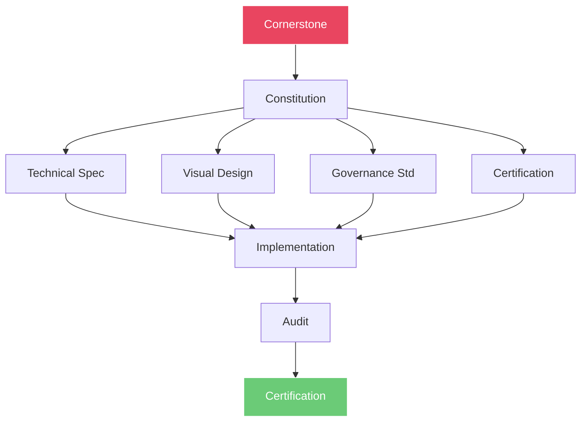

### Phase 1: Constitution Creation

**Ziel:** Eckstein und Kernprinzipien in fundamentales Dokument formalisieren.

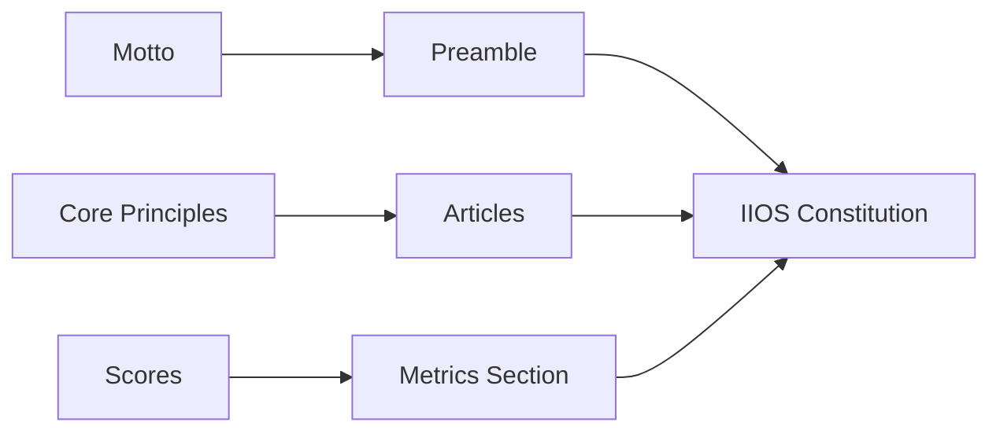

**Schritte:**

1. **Draft Preamble:**
   - Motto als Präambel nutzen
   - Selbstverpflichtung formulieren

2. **Define Articles:**
   - Artikel für jedes Kernprinzip
   - Definition, Wichtigkeit, Grundsätze

3. **Integrate Cornerstone Score:**
   - Beschreibung der Messung
   - Kriterien und Gewichtungen

**Template:** `templates/constitution_template.md`

**Output:** `IIOS_Constitution.md`

---

### Phase 2: Standards Development

**Ziel:** Constitution in operative Standards übersetzen.

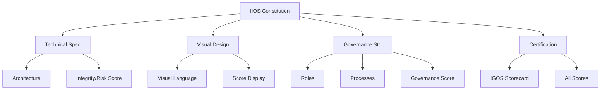

**Technical Specification:**
- Systemarchitektur detaillieren
- Module und Workflows
- Links zu Constitutional Articles
- Integrity Score, Risk Score, Governance Score integrieren

**Visual Design Standard:**
- Visuelle Sprache definieren
- Design-Prinzipien
- Darstellung aller Scores

**Governance Standard:**
- Rollen und Verantwortlichkeiten
- Entscheidungsprozesse
- Governance Score, Compliance Score

**Certification Framework:**
- Zertifizierungsprozess
- IGOS Scorecard
- Alle fünf Scores

---

### Phase 3: Score Calculation & Interpretation

**Ziel:** Klaren Prozess für Score-Berechnung und Interpretation.

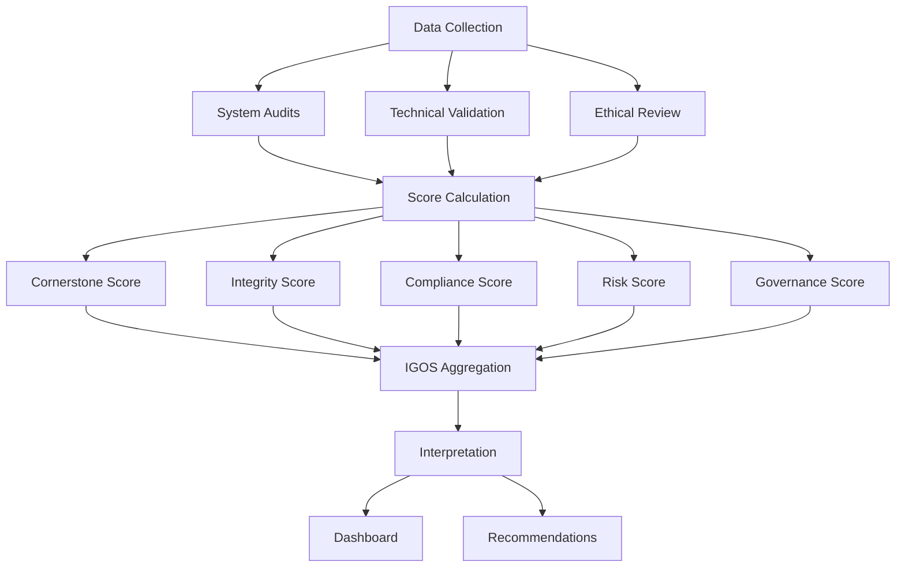

**Gewichtungen:**

| Score | Gewichtung | Bezug |
|-------|------------|-------|
| Cornerstone | 20% | Artikel I |
| Integrity | 20% | Artikel II |
| Compliance | 20% | Artikel III |
| Risk | 15% | Artikel IV |
| Governance | 15% | Artikel V |
| Development | 10% | Artikel VI |

---

## Workflow 3: Eckstein-Auswahl-Entscheidungsbaum

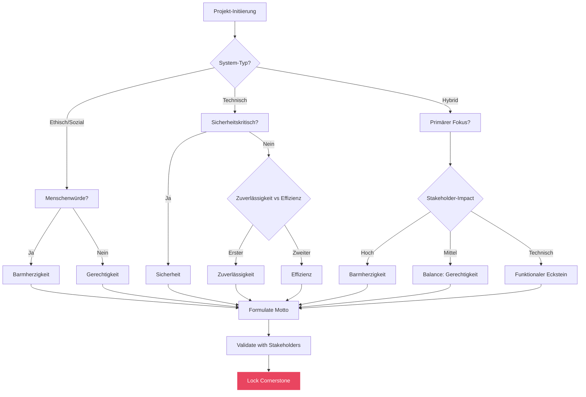

---

## Workflow 4: Zertifizierungsprozess

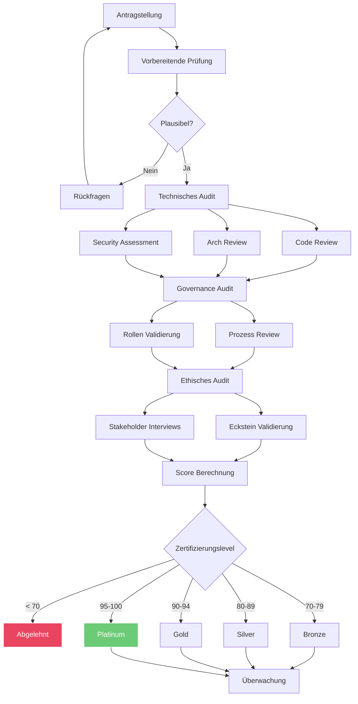

---

## Referenzen

- methodology_guide.md - Detaillierte Methodik
- iios_constitution.md - Verfassungsrahmen
- certification_levels.md - Zertifizierungsstufen
- case_study.md - Praxisbeispiele

---

**Version:** 2.0.0  
**Stand:** 17. Juni 2026  
**Änderung:** Mermaid-Diagramme hinzugefügt
