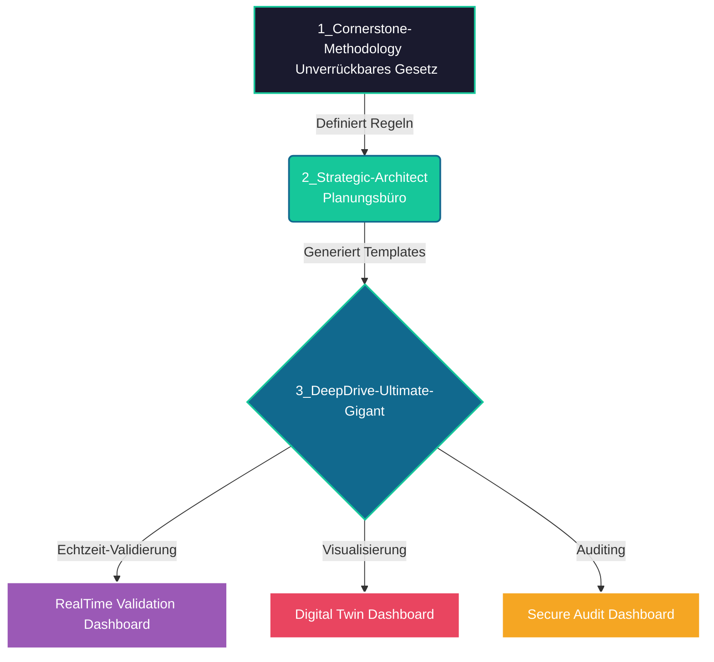
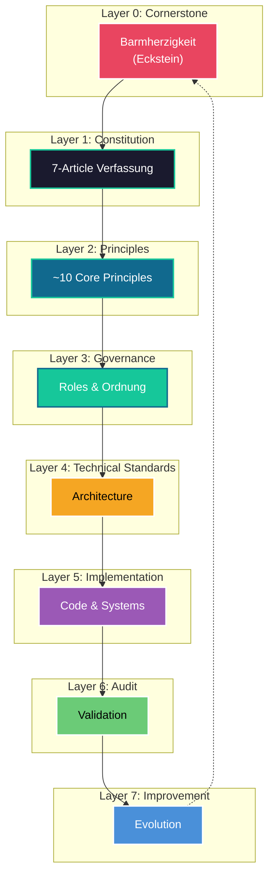

# SystemHeaven Framework v3.0
## Enterprise-Grade Multi-Layer Validation Framework

> **„Barmherzigkeit ist der Eckstein; Wahrheit ihr Maßstab, Recht ihre Ordnung und Entwicklung ihre Frucht."**


---

## 🚀 One-Line Installation

### Linux & macOS
```bash
curl -sSL https://raw.githubusercontent.com/DEIN_USERNAME/DEIN_REPO/main/systemheaven.py | python3
```

### Windows (PowerShell)
```powershell
Invoke-WebRequest -Uri "https://raw.githubusercontent.com/DEIN_USERNAME/DEIN_REPO/main/systemheaven.py" -OutFile "systemheaven.py"; python systemheaven.py; Remove-Item "systemheaven.py"
```

### Alternative: Clone and Install
```bash
git clone https://github.com/DEIN_USERNAME/DEIN_REPO.git
cd DEIN_REPO
python3 systemheaven.py
```

---

## 🌐 SystemHeaven Architektur-Workflow



---

## 📦 What Gets Installed

SystemHeaven creates three integrated packages:

### 📂 Interaktive Paket-Übersicht

<details>
<summary><b>🔍 1_Cornerstone-Methodology (Foundation Layer) - Klicken zum Aufklappen</b></summary>

**Purpose:** Philosophical and methodological core

| File | Purpose |
|------|---------|
| `SKILL.json` | AI Manifest - Zero-prompt execution rules |
| `SKILL.md` | Human-readable guide |
| `references/methodology_guide.md` | Der philosophische Eckstein |
| `references/workflows.md` | Die exakten Scan-Abläufe |
| `references/iios_constitution.md` | 7-Article constitution |
| `references/glossary.md` | Precise term definitions |
| `references/role_model.md` | 6 organizational roles |
| `references/certification_levels.md` | Bronze→Platinum criteria |
| `references/reference_architecture.md` | 8-Layer architecture |
| `references/10_reference_cases.md` | Real-world examples |
| `templates/constitution_template.md` | System constitution template |
| `templates/igos_scorecard_template.md` | Die Audit-Schablone |
| `templates/technical_specification_template.md` | Technical spec template |
| `templates/governance_standard_template.md` | Governance template |
| `templates/certification_framework_template.md` | Certification template |
| `templates/visual_design_standard_template.md` | Visual design template |
| `scripts/build_framework.py` | Template synchronization |
| `scripts/dynamic_validation_engine.py` | Markdown-driven validation |
</details>

<details>
<summary><b>🧠 2_Strategic-Architect (Governance Layer) - Klicken zum Aufklappen</b></summary>

**Purpose:** Strategic architecture and decision-making

| File | Purpose |
|------|---------|
| `SKILL.json` | AI Manifest |
| `SKILL.md` | Human-readable guide |
| `references/methodology_guide.md` | Die gesetzliche Verknüpfung |
| `references/workflows.md` | Strategic workflows |
| `references/strategic_decision_framework.md` | Decision framework |
| `templates/strategic_plan_template.md` | Strategic plan template |
| `templates/decision_log_template.md` | Decision log template |
| `scripts/strategy_validator.py` | Validates strategic decisions |
</details>

<details>
<summary><b>🚀 3_DeepDrive-IIOS-Ultimate-Gigant-v3 (Implementation Layer) - Klicken zum Aufklappen</b></summary>

**Purpose:** Full IIOS Suite with dashboards and tooling

| File | Purpose |
|------|---------|
| `SKILL.json` | AI Manifest |
| `SKILL.md` | Human-readable guide |
| `references/IIOS_Constitution.md` | Constitution reference |
| `references/IIOS_Technical_Specification.md` | Technical specifications |
| `references/IIOS_Visual_Design_Standard.md` | Visual design standard |
| `references/IIOS_Governance_Standard.md` | Governance standard |
| `references/IIOS_Certification_Framework.md` | Certification framework |
| `templates/RealTime_Validation_Dashboard.html` | **Live-Frontend für Datenströme** |
| `templates/Digital_Twin_Dashboard_16x9.html` | **Visueller digitaler Zwilling** |
| `templates/Secure_Audit_Dashboard.html` | **Sicherheits-Audit Dashboard** |
| `scripts/real_time_validator.py` | Real-time validation engine |
| `scripts/score_calculator.py` | IGOS score calculator |
| `scripts/dashboard_server.py` | Dashboard server |
</details>

---

## 🌐 Live Dashboard Vorschau

Die HTML-Dashboards sind über **GitHub Pages** live erlebbar:

1. Gehe zu **Settings → Pages** in deinem Repository
2. Wähle `main` Branch und `/root` als Source
3. Speichern - Deine Dashboards sind unter `https://deinname.github.io/systemheaven/` erreichbar!

🔗 **[Live Demo ansehen](https://deinname.github.io/systemheaven/)** (Nach GitHub Pages Setup)

---

## 📁 Architektur-Dateistruktur

```
systemheaven/
├── 1_Cornerstone-Methodology/          # Foundation Layer
├── 2_Strategic-Architect/               # Governance Layer
└── 3_DeepDrive-IIOS-Ultimate-Gigant-v3/ # Implementation Layer
    └── templates/
        ├── RealTime_Validation_Dashboard.html
        ├── Digital_Twin_Dashboard_16x9.html
        └── Secure_Audit_Dashboard.html
```

---

## 🎯 Zero-Prompt AI Integration

### For Chatbots & AI Agents (ChatGPT, Claude, etc.)

Simply upload these three files to your agent's knowledge base:

1. **`SKILL.json`** - The "brain" that defines execution rules
2. **`references/methodology_guide.md`** - The philosophy
3. **`references/workflows.md`** - The execution workflows

**Result:** The AI automatically knows to:
- Validate every output against the Eckstein (Barmherzigkeit)
- Calculate IGOS Scores (Cornerstone, Integrity, Compliance, Risk, Governance, Development)
- Include Pflichtfeld (mandatory field) validations
- Apply the 8-Layer Architecture

### For IDEs (Cursor, VS Code, GitHub Copilot)

Add the project to your workspace:
```
@SKILL.json
```

The AI will act as your **Strategic Architect**, applying the Cornerstone Methodology to all code and decisions.

---

## 🏛️ The 8-Layer Architecture

```
Layer 0: Cornerstone (Eckstein)          ← Barmherzigkeit
    ↓
Layer 1: Constitution (Verfassung)         ← IIOS Constitution
    ↓
Layer 2: Principles (Prinzipien)           ← ~10 Core Principles
    ↓
Layer 3: Governance (Ordnung)              ← Roles & Processes
    ↓
Layer 4: Technical Standards (Technik)     ← Architecture
    ↓
Layer 5: Implementation (Umsetzung)       ← Code & Systems
    ↓
Layer 6: Audit (Prüfung)                 ← Validation
    ↓
Layer 7: Continuous Improvement          ← Evolution
```

### Visual Architecture Flow



---

## 📊 IGOS Scorecard System

| Score | Weight | Constitution Article | Min for Gold |
|-------|--------|---------------------|--------------|
| **Cornerstone Score** | 20% | Artikel I | ≥90 |
| **Integrity Score** | 20% | Artikel II | ≥90 |
| **Compliance Score** | 20% | Artikel III | ≥90 |
| **Risk Score** | 15% | Artikel IV | ≥85 |
| **Governance Score** | 15% | Artikel V | ≥85 |
| **Development Score** | 10% | Artikel VI | ≥80 |

**IGOS Gesamtscore:** Weighted average (0-100)

### Certification Levels

| Level | Score | Description |
|-------|-------|-------------|
| 🏆 **Platinum** | 95-100% | Exzellenz |
| 🥇 **Gold** | 90-94% | Hervorragend |
| 🥈 **Silver** | 80-89% | Gut |
| 🥉 **Bronze** | 70-79% | Basis |

---

## 🛠️ Usage Examples

### Example 1: Architecture Decision

**Input:** "Which database for our healthcare system?"

**SystemHeaven Response:**
```
1. ECKSTEIN-BEZUG
   Diese Empfehlung dient dem Eckstein der Barmherzigkeit durch 
   maximalen Patientendatenschutz.

2. VERDICHTUNG
   ~1000: Alle DB-Typen → ~100: HIPAA-konforme DBs → 
   ~10: Postgres, MongoDB, CockroachDB, etc. → 
   1: PostgreSQL mit TDE und row-level security

3. HAUPTANTWORT
   PostgreSQL mit Transparent Data Encryption (TDE), 
   row-level security, und Audit-Logging.

4. SCORES
   Cornerstone Score: 95/100
   Integrity Score: 92/100
   Compliance Score: 96/100 (HIPAA, DSGVO)
   Risk Score: 88/100
   Governance Score: 90/100
   Development Score: 85/100
   
   IGOS GESAMT: 92.4/100 → 🥇 GOLD

5. PFLICHTFELD: ECKSTEIN-VALIDIERUNG
   PostgreSQL wurde gewählt weil:
   - TDE schützt Patientendaten (Barmherzigkeit)
   - Row-level security ermöglicht feingranularen Schutz
   - ACID-Compliance garantiert Datenintegrität

6. ALTERNATIVE
   MongoDB (Score 85/100) bei Bedarf an Schema-Flexibilität
```

---

## 📚 Reference Cases (10 Examples)

| # | Case | Eckstein | IGOS Score | Level |
|---|------|----------|------------|-------|
| 1 | Hospital Patient Data | Barmherzigkeit | 90.4 | 🥇 Gold |
| 2 | Citizen Portal | Gerechtigkeit | 87.6 | 🥈 Silver |
| 3 | Autonomous Vehicles | Menschenwürde | 88.7 | 🥈 Silver |
| 4 | Crypto Exchange | Sicherheit | 86.7 | 🥈 Silver |
| 5 | Smart Grid | Nachhaltigkeit | 88.6 | 🥈 Silver |
| 6 | E-Learning | Gerechtigkeit | 86.5 | 🥈 Silver |
| 7 | Air Freight | Zuverlässigkeit | 88.3 | 🥈 Silver |
| 8 | Facial Recognition | Barmherzigkeit | 76.5 | 🥉 Bronze |
| 9 | Neobank | Zuverlässigkeit | 92.6 | 🥇 Gold |
| 10 | Medical AI | Barmherzigkeit | 90.6 | 🥇 Gold |

---

## 🔧 Advanced Usage

### Dynamic Validation Engine

```bash
# Parse framework documents and extract rules
python scripts/dynamic_validation_engine.py parse

# Export rules as JSON
python scripts/dynamic_validation_engine.py export --output rules.json

# Validate a system
python scripts/dynamic_validation_engine.py validate --system my_system.json
```

### Build Framework (Synchronization)

```bash
# Synchronize templates across all packages
python scripts/build_framework.py sync

# Full build with validation
python scripts/build_framework.py build

# Generate dashboard files
python scripts/build_framework.py dashboard
```

---

## 🌟 Key Features

- ✅ **Zero-Prompt AI Integration** - SKILL.json as system prompt
- ✅ **Cross-Platform** - Linux, macOS, Windows
- ✅ **One-Line Installation** - No manual configuration
- ✅ **8-Layer Architecture** - Complete methodology coverage
- ✅ **6-Dimensional Scoring** - Quantified validation
- ✅ **4-Tier Certification** - Bronze to Platinum
- ✅ **Dynamic Validation** - Markdown-driven rule extraction
- ✅ **HTML Dashboards** - Real-time score visualization
- ✅ **10 Reference Cases** - Real-world examples
- ✅ **Enterprise-Ready** - Role model and governance

---

## 📖 Documentation

| Document | Purpose |
|----------|---------|
| `references/methodology_guide.md` | Core philosophy and methodology |
| `references/iios_constitution.md` | 7-Article constitution |
| `references/glossary.md` | Precise term definitions |
| `references/role_model.md` | 6 organizational roles |
| `references/certification_levels.md` | Bronze to Platinum criteria |
| `references/reference_architecture.md` | 8-Layer architecture |
| `references/workflows_enhanced.md` | Mermaid workflow diagrams |
| `references/llm_instruction_guide.md` | AI system prompt template |
| `references/10_reference_cases.md` | Real-world examples |

---

## 🚀 Push to GitHub

Wenn deine Dateien bereitstehen, pushe das Ganze mit diesen Befehlen auf GitHub:

```bash
# 1. Git initialisieren (falls noch nicht geschehen)
git init

# 2. Alle Dateien hinzufügen
git add .

# 3. Aussagekräftigen Commit erstellen
git commit -m "Feat: Initialize SystemHeaven Framework v3 with interactive visual dashboards and automated installer"

# 4. Main-Branch festlegen und mit GitHub verbinden
git branch -M main
git remote add origin https://github.com/DEIN_USERNAME/systemheaven.git

# 5. Hochladen
git push -u origin main
```

### GitHub Pages Aktivieren

1. Gehe zu **Settings → Pages** im Repository
2. Source: `Deploy from a branch`
3. Branch: `main` / `/root`
4. Klicke **Save**
5. Füge die generierte URL unter **About → Website** ein

---

## 🤝 Contributing

SystemHeaven is designed as a living framework. Contributions should:

1. Respect the **Eckstein** (Barmherzigkeit) as unverrückbares Fundament
2. Include **Pflichtfeld: Eckstein-Validierung** in all templates
3. Maintain **Score-based quantification**
4. Follow the **8-Layer Architecture**

---

## 📜 License

**IIOS Constitution License**

This framework is governed by the principles defined in the IIOS Constitution:
- Barmherzigkeit als Eckstein
- Wahrheit als Maßstab
- Recht als Ordnung
- Sicherheit & Nachhaltigkeit als Fundament
- Entwicklung als Ziel

---

## 🙏 Acknowledgments

SystemHeaven combines:
- **Cornerstone Philosophy** (Barmherzigkeit as normative anchor)
- **Strategic Architecture** (8-Layer methodology)
- **DeepDrive IIOS** (Implementation and tooling)

---

**Version:** 3.0.0  
**Framework:** SystemHeaven / IIOS  
**Tagline:** *Barmherzigkeit ist der Eckstein; Wahrheit ihr Maßstab, Recht ihre Ordnung und Entwicklung ihre Frucht.*

🌟 **Install now and elevate your AI systems to enterprise-grade ethical standards!**
